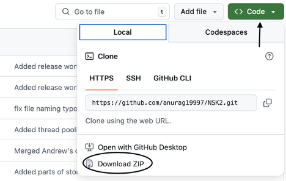
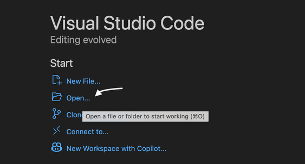
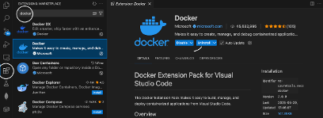
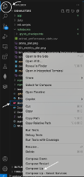
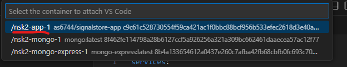
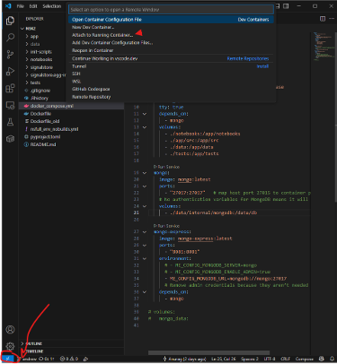
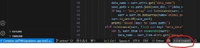

# Instructions to Run Adapter and AP

## Prerequisites

### Step 1: Download Test Dataset
- Download the dataset from [Google Drive](https://drive.google.com/drive/folders/1fxIGi71HqmqC1akoEfoyHBpPJ_cTdVQz?usp=drive_link).

### Step 2: Neuroscikit-2 Code
- Clone the Neuroscikit-2 repository from GitHub:
  ```bash
  git clone https://github.com/anurag19997/NSK2
  ```
- Ensure you are on the `andrew` branch:
  ```bash
  git checkout andrew
  ```

- Alternatively you can download zip file: 



### Step 3: Install Required Software
- **Docker Desktop**: [Download Docker Desktop](https://www.docker.com/products/docker-desktop/) appropriate for your OS.
- **VS Code**: [Download VS Code](https://code.visualstudio.com/download).
- **Xserver (for Windows only)**: [Download Xserver](https://sourceforge.net/projects/vcxsrv/).

### Step 4: Setup Xserver (Windows)
- Launch `Xlaunch`:
  - Select `Multiple windows`.
  - Select `Start no client`.
  - Select `Disable access control`.
  - Allow the prompts.

## Setup and Execution

### Step 5: Configure VS Code
- Open VS Code and open the cloned `Neuroscikit-2` folder.
- Install the following extensions via the VS Code extension search:

  - Docker
  - Python
  - Jupyter

### Step 6: Docker Setup
- Launch Docker Desktop and sign in with lab's Docker account posted on account-info channel on slack.
- In VS Code, navigate to `docker_compose.yml`, right-click, and select **Compose Up**.

### Step 7: Dataset Placement
- Extract the downloaded test dataset.
- Place it in the `/app/data` folder using your OS file explorer.

### Step 8: Container Attachment
- In VS Code, click on the Docker container icon at the bottom left.
- `Attach to Running container `
- Select the main app container; it will open a new VS Code window.
- Close the previous VS Code window.





### Step 9: Run Adapter
- Navigate to `/app/src/Adapters/run.py`.
- Select the `nskfull` environment in VS Code.
- Execute the script by pressing the play button or choosing `Run → Run without debugging`.
- Select your input folder when prompted.
- Processed data (`.netcdf` or `.nc`) files are saved in `/app/data/input`.


### Step 10: Run Animal Performance Notebook
- Open `notebooks/animal_performance.ipynb` in VS Code.
- Click **Run All**.
- Follow prompts for installing necessary extensions.

### Additional: Run Neurofunc
- Repeat the notebook execution step for `neurofunc.ipynb`.
- Queries and settings can be modified as YAML files in:
  ```
  /app/src/queries_and_settings
  ```
  


# Caveats

1D data (e.g. spike labels or spike times) have to be saved as 2D with an extra dimension e.g. (index, 1)
This is because of the xarray function "is_list_of_strings" that requires the extra dimension
1D data will be encoded as 2D with the extra dimension termed "1"
